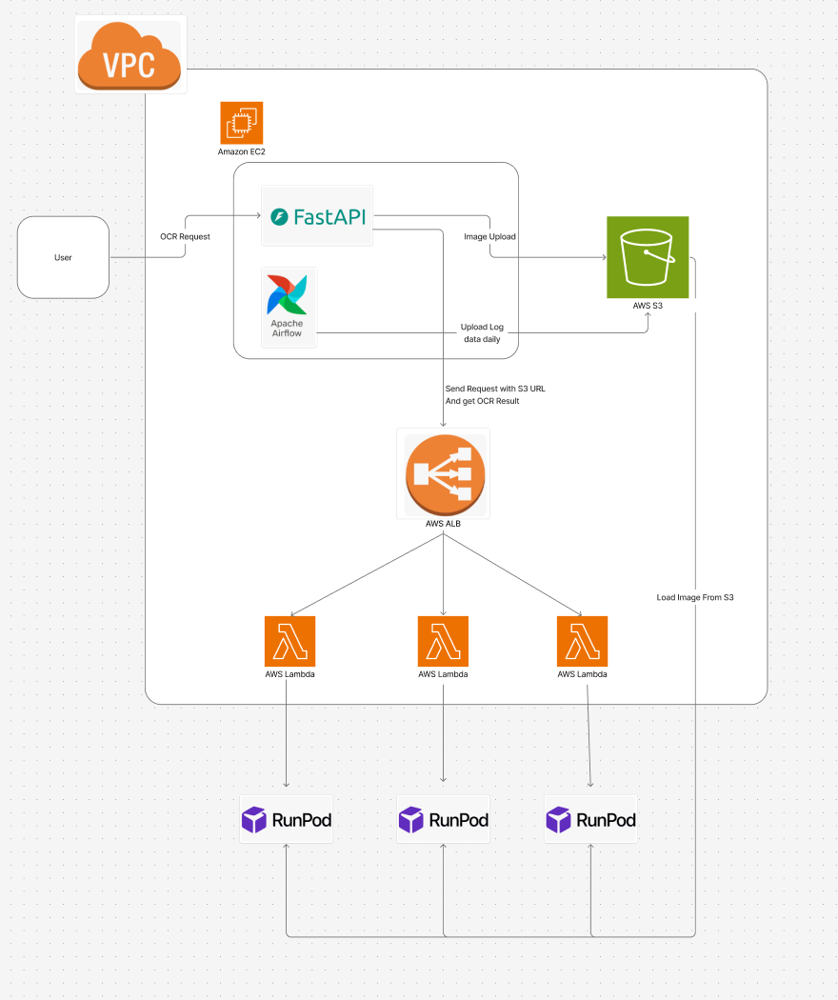

# 🧠 OCR Inference System with Scalable Cloud Infrastructure

This project builds upon [MonkeyOCR](https://github.com/Yuliang-Liu/MonkeyOCR), an open-source OCR research repository, by extending it into a **cloud-deployable, production-ready inference system**. While the original project focused on model performance, this version is designed for **real-world usage with a robust MLOps infrastructure**.

## 📌 Overview

- Handles OCR requests via a FastAPI server on an EC2 instance
- Uploads user-submitted images to AWS S3
- Sends inference requests through AWS ALB (Application Load Balancer)
- AWS Lambda functions act as lightweight API proxies to external GPU servers on RunPod
- Uses Apache Airflow to batch and upload daily log data to S3

## 📖 Project Background

This work is based on [MonkeyOCR](https://github.com/Yuliang-Liu/MonkeyOCR), which provides a high-performance scene text recognition model.  
I refactored and restructured the codebase to fit a cloud-native architecture, focusing on:
- API-based usage in real environments
- Scalable and modular serving architecture
- Decoupling the model from local execution for cloud deployment

## 🖼️ System Architecture

## 🔨 Key Contributions

- Adapted a research-level OCR model to a production-serving architecture
- Built a **hybrid cloud deployment** using AWS (serverless) + RunPod (GPU inference)
- Developed a **FastAPI-based request handler** for S3 integration
- Designed an **event-driven, scalable API gateway** using AWS ALB and Lambda
- Automated daily logging with **Apache Airflow**
- Managed asynchronous communication between Lambda and GPU backend
- Implemented A/B testing using AWS ALB by routing traffic between multiple model versions
- Integrate response time logging

## 📦 Tech Stack

- AWS EC2, S3, ALB, Lambda
- RunPod (GPU inference)
- FastAPI
- Apache Airflow
- Python 3.11

## 🔍 Future Improvements

- Automate deployment with CI/CD (e.g., GitHub Actions, Terraform)
- Improve GPU resource management and job queuing for RunPod

---

For model-specific configurations (e.g., weights, config files, and tokenizer settings), please refer to the original [MonkeyOCR repository](https://github.com/Yuliang-Liu/MonkeyOCR).  
This project focuses on infrastructure and deployment, and assumes you have set up the OCR model according to the original repository.

Feel free to explore the architecture and use it as a starting point for your own production-level AI inference service!